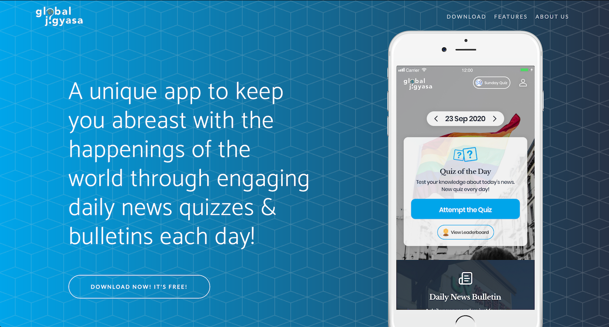

# [Global Jigyasa](https://www.globaljigyasa.com)

## Status

## Preview

## Configuration and edits

This site is hosted on netlify. To make and changes, follow the following steps:

* Clone this repo
* Any change on the master branch will automatically be deployed to production
